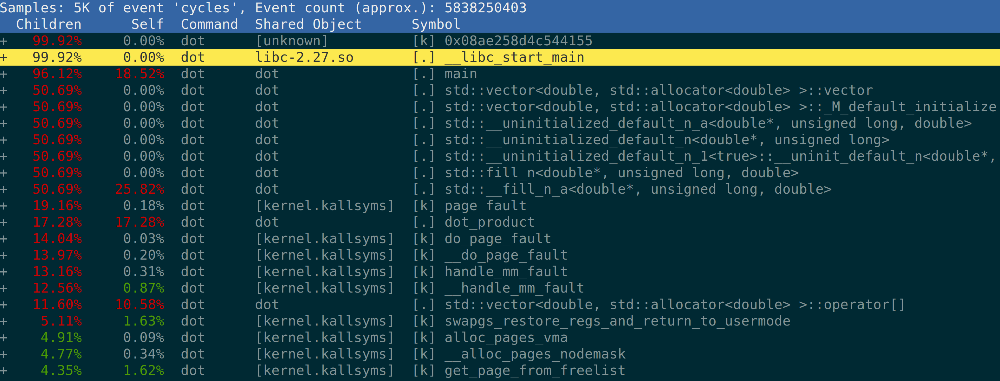
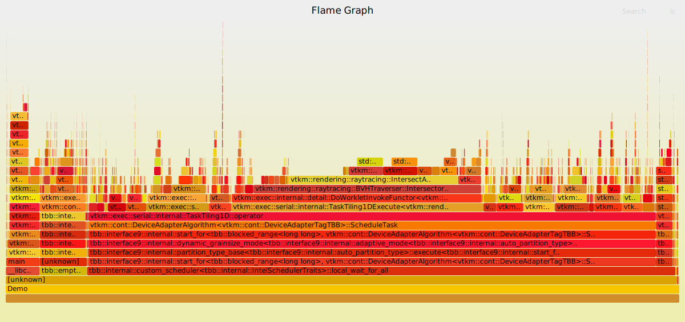
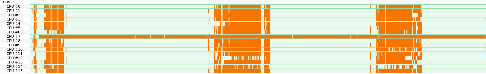

slidenumbers: true

# Performance Tuning


Nick Thompson

^ Thanks for coming. First let's give a shoutout to Matt Wolf for putting this tutorial together, and to Barney Maccabe for putting the support behind it to make it happen.

---

Session 1: Using `perf`

[Follow along](https://github.com/NAThompson/performance_tuning_tutorial):

```
$ git clone https://github.com/NAThompson/performance_tuning_tutorial
$ cd performance_tuning_tutorial
$ make
$ ./dot 100000000
```

^ This is a tutorial, so definitely follow along. I will be pacing this under the assumption you will be following along, so you'll get bored if you're watching. In addition, at the end of the tutorial we'll do a short quiz, not to stress anyone out, but to solidify the concepts. I hope that'll galvanize us to bring a bit more intensity than usually brought to a six hour training session! If the stakes are too low, we're just gonna waste two good mornings.

^ Please get the notes from github, and attempt to issue the commands.

---

## What is `perf`?

 - Performance tools for linux
 - Designed to profile kernel, but can profile userspace apps
 - Sampling based
 - Canonized in linux kernel source code

---

## Installing `perf`: Ubuntu

```bash
$ sudo apt install linux-tools-common
$ sudo apt install linux-tools-generic
$ sudo apt install linux-tools-`uname -r`
```

^ Installation is pretty easy on Ubuntu.

---

## Installing `perf`: CentOS

```bash
$ yum install perf
```

---

## Access `perf`:

`perf` is available on Summit (summit.olcf.ornl.gov), Andes (andes.olcf.ornl.gov) and the SNS nodes (analysis.sns.gov)

I have verified that all the commands of this tutorial work on Andes.

---

## Installing `perf`: Source build

```bash
$ git clone --depth=1 https://github.com/torvalds/linux.git
$ cd linux/tools/perf;
$ make
$ ./perf
```

^ I like doing source builds of `perf`. Not only because I often don't have root, but also because `perf` improves over time, so I like to get the latest version. For example, new hardware counters were recently added for the Power9 architecture.

---

## Please do a source build for this tutorial!

A source build is the first step to owning your tools, and will help us all be on the same page.

---

## Ubuntu Dependencies

```
$ sudo apt install -y bison flex libslang2-dev systemtap-sdt-dev \
   libnuma-dev libcap-dev libbabeltrace-ctf-dev libiberty-dev python-dev
```

---

# `perf_permissions.sh`

```bash
#!/bin/bash

# Taken from Milian Wolf's talk "Linux perf for Qt developers"
sudo mount -o remount,mode=755 /sys/kernel/debug
sudo mount -o remount,mode=755 /sys/kernel/debug/tracing
echo "0" | sudo tee /proc/sys/kernel/kptr_restrict
echo "-1" | sudo tee /proc/sys/kernel/perf_event_paranoid
sudo chown `whoami` /sys/kernel/debug/tracing/uprobe_events
sudo chmod a+rw /sys/kernel/debug/tracing/uprobe_events
```

^ If we have root, we have the ability to extract more information from `perf` traces. Kernel debug symbols are a nice to have, but not a need to have, so if you don't have root, don't fret too much.

---

## `perf` MWE

```bash
$ perf stat ls
data  Desktop  Documents  Downloads  Music  Pictures  Public  Templates  TIS  Videos

 Performance counter stats for 'ls':

              2.78 msec task-clock:u              #    0.094 CPUs utilized          
                 0      context-switches:u        #    0.000 K/sec                  
                 0      cpu-migrations:u          #    0.000 K/sec                  
               283      page-faults:u             #    0.102 M/sec                  
           838,657      cycles:u                  #    0.302 GHz                    
           584,659      instructions:u            #    0.70  insn per cycle         
           128,106      branches:u                #   46.109 M/sec                  
             7,907      branch-misses:u           #    6.17% of all branches        

       0.029630910 seconds time elapsed

       0.000000000 seconds user
       0.003539000 seconds sys
```

^ This is the `perf` "hello world". You might see something a bit different depending on your architecture and `perf` version.

---

## Why `perf`?

There are lots of great performance analysis tools (Intel VTune, Score-P, tau, cachegrind), but my opinion is that `perf` should be the first tool you reach for.

---

## Why `perf`?

- No fighting for a license, or install Java runtimes on HPC clusters
- No need to vandalize source code, or be constrained to work with a set of specific languages
- Text GUI, so easy to use in terminal and over `ssh`

---

## Why `perf`?

- Available on any Linux system
- Not limited to x86: works on ARM, RISC-V, PowerPC, Sparc
- Samples rather than models your program
- Doesn't slow your program down

^ I was trained in mathematics, and I love learning math because it feels permanent. The situation in computer science is much worse. For example, if no one decides to write a Fortran compiler that targets the new Apple M1 chip, there's no Fortran on the Apple M1! So learning tools which will last is important to me.

^ `perf` is part of the linux kernel, so it has credibility that it will survive for a long time. It also works on any architecture Linux compiles on, so it's widely available. As a sampling profiler, it relies on statistics, not a model of your program.

---

## Why not `perf`?

- Text GUI, so fancy graphics must be generated by post-processing
- *Only* available on Linux
- Significant limitations when profiling GPUs

---

### `src/mwe.cpp`

```cpp
#include <iostream>
#include <vector>

double dot_product(double* a, double* b, size_t n) {
    double d = 0;
    for (size_t i = 0; i < n; ++i) {
        d += a[i]*b[i];
    }
    return d;
}

int main(int argc, char** argv) {
    if (argc != 2) {
        std::cerr << "Usage: ./dot 10\n";
        return 1;
    }
    size_t n = atoi(argv[1]);
    std::vector<double> a(n);
    std::vector<double> b(n);
    for (size_t i = 0; i < n; ++i) {
        a[i] = i;
        b[i] = 1/double(i+3);
    }
    double d = dot_product(a.data(), b.data(), n);
    std::cout << "a·b = " << d << "\n";
}
```

---

## Running the MWE under `perf`

```bash
$ g++ src/mwe.cpp
$ perf stat ./a.out 1000000000
a.b = 1e+09

 Performance counter stats for './a.out 1000000000':

         14,881.09 msec task-clock:u              #    0.999 CPUs utilized
                 0      context-switches:u        #    0.000 K/sec
                 0      cpu-migrations:u          #    0.000 K/sec
            17,595      page-faults:u             #    0.001 M/sec
    39,657,728,345      cycles:u                  #    2.665 GHz                      (50.00%)
    27,974,789,022      stalled-cycles-frontend:u #   70.54% frontend cycles idle     (50.01%)
     6,000,965,962      stalled-cycles-backend:u  #   15.13% backend cycles idle      (50.01%)
    88,999,950,765      instructions:u            #    2.24  insn per cycle
                                                  #    0.31  stalled cycles per insn  (50.00%)
    15,998,544,101      branches:u                # 1075.093 M/sec                    (49.99%)
            37,578      branch-misses:u           #    0.00% of all branches          (49.99%)

      14.892496917 seconds time elapsed

      13.566616000 seconds user
       1.199643000 seconds sys
```

^ If you have a different `perf` version, you might see `stalled-cycles:frontend` and `stalled-cycles:backend`.
Stalled frontend cycles are those where instructions could not be decoded fast enough to operate on the data.
Stalled backend cycles are those where data did not arrive fast enough. Backend cycles stall much more frequently than frontend cycles. See [here](https://stackoverflow.com/questions/22165299) for more details.

---

## Learning from `perf stat`

- 2.24 instructions/cycle and large number of stalled frontend cycles means we're probably CPU bound. Right? Right?? (Stay tuned)
- Our branch miss rate is really good!

But it's not super informative, nor is it actionable.

---

## Aside on 'frontend-cycles' vs 'backend-cycles'


[Source](https://software.intel.com/content/www/us/en/develop/documentation/vtune-cookbook/top/methodologies/top-down-microarchitecture-analysis-method.html)

This is how Intel divvies up the "frontend" and "backend" of the CPU. Frontend is responsible for instruction scheduling and decoding, the backend is for executing instructions and fetching data.

---

> The cycles stalled in the back-end are a waste because the CPU has to wait for resources (usually memory) or to finish long latency instructions (e.g. transcedentals - sqrt, reciprocals, divisions, etc.). The cycles stalled in the front-end are a waste because that means that the Front-End does not feed the Back End with micro-operations. This can mean that you have misses in the Instruction cache, or complex instructions that are not already decoded in the micro-op cache. Just-in-time compiled code usually expresses this behavior.

-- [stackoverflow](https://stackoverflow.com/a/29059380/)

---

## Learning from `perf stat`

`perf` is written by kernel developers, so the `perf stat` defaults are for them.

At ORNL, we're HPC developers, so let's make some changes. What stats do we have available?

---

```
$ perf list
List of pre-defined events (to be used in -e):

  branch-misses                                      [Hardware event]
  cache-misses                                       [Hardware event]
  cache-references                                   [Hardware event]
  instructions                                       [Hardware event]
  task-clock                                         [Software event]

  L1-dcache-load-misses                              [Hardware cache event]
  L1-dcache-loads                                    [Hardware cache event]
  LLC-load-misses                                    [Hardware cache event]
  LLC-loads                                          [Hardware cache event]

  cache-misses OR cpu/cache-misses/                  [Kernel PMU event]
  cache-references OR cpu/cache-references/          [Kernel PMU event]
  power/energy-cores/                                [Kernel PMU event]
  power/energy-pkg/                                  [Kernel PMU event]
  power/energy-ram/                                  [Kernel PMU event]
```

^ Every architecture has a different set of PMCs, so this list will be different for everyone. I like the `power` measurements, since speed is not the only sensible objective we might want to pursue.

---

## Custom events

```
perf stat -e instructions,cycles,L1-dcache-load-misses,L1-dcache-loads,LLC-load-misses,LLC-loads ./dot 100000000
a.b = 9.99999e+07

 Performance counter stats for './dot 100000000':

     8,564,368,466      instructions:u            #    1.41  insn per cycle           (49.98%)
     6,060,955,584      cycles:u                                                      (66.65%)
        34,089,080      L1-dcache-load-misses:u   #    0.90% of all L1-dcache hits    (83.34%)
     3,805,929,303      L1-dcache-loads:u                                             (83.32%)
           854,522      LLC-load-misses:u         #   39.87% of all LL-cache hits     (33.31%)
         2,143,437      LLC-loads:u                                                   (33.31%)

       5.045450844 seconds time elapsed

       2.856660000 seconds user
       2.185739000 seconds sys
```

^ Hmm . . . 40% LL cache miss rate, yet 1.4 instructions/cycle. This CPU-bound vs memory-bound is a bit complicated . . .

^ Personally I don't regard CPU-bound vs memory-bound to be an "actionable" way of thinking. We can turn a slow CPU bound program into a fast memory-bound program by just not doing dumb stuff.

---

## Custom events: gotchas

These events are not stable across CPU architectures, nor even `perf` versions!

The events expose the functionality of hardware counters; different hardware has different counters.

And someone needs to do the work of exposing them in `perf`!

---

```
$ perf list
  cycle_activity.stalls_l1d_pending                 
       [Execution stalls due to L1 data cache misses]
  cycle_activity.stalls_l2_pending                  
       [Execution stalls due to L2 cache misses]
  cycle_activity.stalls_ldm_pending                 
       [Execution stalls due to memory subsystem]
$ perf stat -e cycle_activity.stalls_ldm_pending,cycle_activity.stalls_l2_pending,cycle_activity.stalls_l1d_pending,cycles ./dot 10000000
a.b = 9.99999e+07

 Performance counter stats for './dot 100000000':

       509,998,525      cycle_activity.stalls_ldm_pending:u                                   
       127,137,070      cycle_activity.stalls_l2_pending:u                                   
        70,555,574      cycle_activity.stalls_l1d_pending:u                                   
     5,708,220,052      cycles:u                                                    

       3.637099623 seconds time elapsed

       2.463966000 seconds user
       1.172459000 seconds sys
```

---

## Kinda painful typing these events: Use `-d` (`--detailed`)

```
$ perf stat -d ./dot 100000000
 Performance counter stats for './dot 100000000':

          1,945.17 msec task-clock:u              #    0.970 CPUs utilized
                 0      context-switches:u        #    0.000 K/sec
                 0      cpu-migrations:u          #    0.000 K/sec
           390,463      page-faults:u             #    0.201 M/sec
     3,329,516,701      cycles:u                  #    1.712 GHz                      (49.97%)
     1,272,884,914      instructions:u            #    0.38  insn per cycle           (62.50%)
       150,445,759      branches:u                #   77.343 M/sec                    (62.55%)
            14,766      branch-misses:u           #    0.01% of all branches          (62.53%)
        76,672,490      L1-dcache-loads:u         #   39.417 M/sec                    (62.53%)
        51,315,841      L1-dcache-load-misses:u   #   66.93% of all L1-dcache hits    (62.52%)
         7,867,383      LLC-loads:u               #    4.045 M/sec                    (49.94%)
         7,618,746      LLC-load-misses:u         #   96.84% of all LL-cache hits     (49.96%)

       2.005801176 seconds time elapsed

       0.982545000 seconds user
       0.963534000 seconds sys
```

---

## `perf stat -d` output on Andes

```
[nthompson@andes-login1]~/performance_tuning_tutorial% perf stat -d ./dot 1000000000
a.b = 1e+09

 Performance counter stats for './dot 1000000000':

          2,242.43 msec task-clock:u              #    0.999 CPUs utilized
                 0      context-switches:u        #    0.000 K/sec
                 0      cpu-migrations:u          #    0.000 K/sec
             8,456      page-faults:u             #    0.004 M/sec
     2,972,264,893      cycles:u                  #    1.325 GHz                      (29.99%)
         1,366,982      stalled-cycles-frontend:u #    0.05% frontend cycles idle     (30.02%)
       747,429,126      stalled-cycles-backend:u  #   25.15% backend cycles idle      (30.07%)
     3,499,896,128      instructions:u            #    1.18  insn per cycle
                                                  #    0.21  stalled cycles per insn  (30.06%)
       749,888,957      branches:u                #  334.410 M/sec                    (30.02%)
             9,206      branch-misses:u           #    0.00% of all branches          (29.98%)
     1,108,395,106      L1-dcache-loads:u         #  494.284 M/sec                    (29.97%)
        36,998,921      L1-dcache-load-misses:u   #    3.34% of all L1-dcache accesses  (29.97%)
                 0      LLC-loads:u               #    0.000 K/sec                    (29.97%)
                 0      LLC-load-misses:u         #    0.00% of all LL-cache accesses  (29.97%)

       2.244079417 seconds time elapsed

       1.000742000 seconds user
       1.214037000 seconds sys
```

^ Lots of backend cycles stalled in this one. This could be from high latency operations like divisions or from slow memory accesses.

---

## `perf stat` on a different type of computation

```
[nthompson@andes-login1]~/performance_tuning_tutorial% perf stat -d git archive --format=tar.gz --prefix=HEAD/ HEAD > HEAD.tar.gz

 Performance counter stats for 'git archive --format=tar.gz --prefix=HEAD/ HEAD':

             99.81 msec task-clock:u              #    0.795 CPUs utilized
                 0      context-switches:u        #    0.000 K/sec
                 0      cpu-migrations:u          #    0.000 K/sec
             1,408      page-faults:u             #    0.014 M/sec
       276,165,489      cycles:u                  #    2.767 GHz                      (28.07%)
        72,227,873      stalled-cycles-frontend:u #   26.15% frontend cycles idle     (28.36%)
        60,614,109      stalled-cycles-backend:u  #   21.95% backend cycles idle      (29.37%)
       394,352,577      instructions:u            #    1.43  insn per cycle
                                                  #    0.18  stalled cycles per insn  (30.58%)
        66,882,750      branches:u                #  670.113 M/sec                    (31.95%)
         2,974,856      branch-misses:u           #    4.45% of all branches          (32.23%)
       183,326,327      L1-dcache-loads:u         # 1836.788 M/sec                    (31.19%)
            49,245      L1-dcache-load-misses:u   #    0.03% of all L1-dcache accesses  (30.05%)
                 0      LLC-loads:u               #    0.000 K/sec                    (29.37%)
                 0      LLC-load-misses:u         #    0.00% of all LL-cache accesses  (28.84%)

       0.125489614 seconds time elapsed

       0.092736000 seconds user
       0.006905000 seconds sys
```

^ Compression has much higher instruction complexity than a dot product, and we see that reflected here in the stalled frontend cycles. We also have a much higher branch miss rate.

---

## `perf stat` is great for reporting . . .

But not super actionable.

---

## Get Actionable Data

```
$ perf record -g ./dot 100000000
a.b = 9.99999e+07
[ perf record: Woken up 3 times to write data ]
[ perf record: Captured and wrote 0.735 MB perf.data (5894 samples) ]
$ perf report -g -M intel
```



---

## Wait, what's actionable about this?

See how half the time is spend in the `std::vector` allocator?

That be a clue.

---

## Self and Children

- The `Self` column says how much time was taken within the function.
- The `Children` column says how much time was spent in functions called by the function.

- If the `Children` column value is very near the `Self` column value, that function isn't your hotspot!


---

If `Self` and `Children` is confusing, just get rid of it:

```bash
$ perf report -g -M intel --no-children
```

---

## More intelligible `perf report`

```bash
$ perf report --no-children -s dso,sym,srcline
```

Best to put this in a `perf config`:

```
$ perf config --user report.children=false
$ cat ~/.perfconfig
[report]
	children = false
```

---

## Some other nice config options

```
$ perf config --user annotate.disassembler_style=intel
$ perf config --user report.percent-limit=0.1
```

---

## Disassembly


---

## What is happening?????

- If you don't know x86 assembly, I recommend Ray Seyfarth's [Introduction to 64 Bit Assembly Language Programming for Linux and OS X](http://rayseyfarth.com/asm/)

- If you need to look up instructions one at a time, Felix Cloutier's [x64 reference](https://www.felixcloutier.com/x86/) is a great resource.

- If you need to examine how compiler flags interact with generated assembly, try [godbolt](https://godbolt.org).

---

## Detour: System V ABI (Linux)

- Floating point arguments are passed in registers `xmm0-xmm7`.
- Integer parameters are passed in registers `rdi`, `rsi`, `rdx`, `rcx`, `r8`, and `r9`, in that order.
- A floating point return value is placed in register `xmm0`.
- Integer return values are placed in `rax`.

Knowing this makes your godbolt's a bit easier to read!

---

## The default assembly generated by gcc is braindead

See the [godbolt](https://godbolt.org/z/8qqhGj).

- Superfluous stack writes.
- No AVX instructions, no fused-multiply adds

Consequence: Lots of time spent moving data around.

---

## Sidetrack: Fused-multiply add

We'll use the fused-multiply add instruction as a "canonical" example of an instruction which we *want* generated, but due to history, chaos, and dysfunction, generally *isn't*.

---

## Sidetrack: Fused-multiply add

The fma is defined as

$$
\mathrm{fma}(a,b,c) := \mathrm{rnd}(a*b + c)
$$

i.e., the multiplication and addition is performanced in a single instruction, with a single rounding.

^ I recently determined `gcc` wasn't generating fma's in our flagship product VTK-m. It's often said that it's meaningless to talk about performance of code compiled without optimizations. Implicit in this statement is another: It's incredibly difficult to convince the compiler to generate optimized assembly! (The Intel compiler is very good in this regard.)

---

## My preferred CPPFLAGS:

```
-g -O3 -ffast-math -fno-finite-math-only -march=native -fno-omit-frame-pointer
```

How does that look on [godbolt](https://godbolt.org/z/4dnfYb)?

Key instruction: `vfmadd132pd`; vectorized fused multiply add on `xmm`/`ymm` registers.

---

## Recompile with good flags

```
$ make
$ perf stat ./dot 100000000     
a.b = 9.99999e+07

 Performance counter stats for './dot 100000000':

          2,428.06 msec task-clock:u              #    0.998 CPUs utilized          
                 0      context-switches:u        #    0.000 K/sec                  
                 0      cpu-migrations:u          #    0.000 K/sec                  
           390,994      page-faults:u             #    0.161 M/sec                  
     3,651,637,732      cycles:u                  #    1.504 GHz                    
     1,676,766,309      instructions:u            #    0.46  insn per cycle         
       225,636,250      branches:u                #   92.929 M/sec                  
             9,303      branch-misses:u           #    0.00% of all branches        

       2.432163719 seconds time elapsed
```

1/3rd of the instructions/cycle, yet twice as fast, because it ran ~1/5th the number of instructions.


---

# Exercise

Look at the code of `src/mwe.cpp`. Is it really measuring a dot product? Look at it under `perf report`.

Fix it if not.

^ The performance of `src/mwe.cpp` is dominated by the cost of initializing data.
^ The data initialization converts integers to floats and does divisions. Removing these increases the performance.
^ Even once this is done, 40% of the time is spent in data allocation. This indicates a need for a more sophisticated approach.

---

## Register width

- The 8008 architecture from 1972 had 8 bit registers, now vaguely resembling our current `al` register.

- 16 bit registers were added to the 8086 in 1972; now labelled `ax`.

- 32 bit registers on the 80386 architecture in 1985; these are now prefixed with `e`, such as the `eax`, `ebx`, so on.

- 64 bit registers were added in 2003 for the `x86_64` architecture. They are prefixed with `r`, such as the `rax` and `rbx` registers.

---

## Register width

Compilers utilize the full width of integer registers without much fuss. The situation for floating point registers is much worse.


---

## Floating point register width

An `xmm` register is 128 bits wide, and can hold 2 doubles, or 4 floats.

AVX2 introduced the `ymm` registers, which are 256 bits wide, and can hold 4 doubles, or 8 floats.

AVX-512 (2016) introduced the `zmm` registers, which can hold 8 doubles or 16 floats.

---

To determine if your CPU has `ymm` registers, check for avx2 instruction support:

```bash
$ lscpu | grep avx2
Flags:
fpu vme de pse tsc msr pae mce cx8 apic sep mtrr pge mca cmov pat pse36 clflush
dts acpi mmx fxsr sse sse2 ss ht tm pbe syscall nx rdtscp lm constant_tsc arch_perfmon
pebs bts rep_good nopl xtopology nonstop_tsc aperfmperf eagerfpu pni pclmulqdq dtes64
monitor ds_cpl vmx smx est tm2 ssse3 cx16 xtpr pdcm pcid sse4_1 sse4_2 x2apic popcnt
tsc_deadline_timer aes xsave avx f16c rdrand lahf_lm epb tpr_shadow vnmi
flexpriority ept vpid fsgsbase smep erms xsaveopt dtherm ida arat pln pts
```

or (on Centos)

```bash
$ cat /proc/cpuinfo | grep avx2
```

---

## Mind bogglement

I couldn't get `gcc` or `clang` to generate AVX-512 instructions, so I went looking for the story . . .

---

## Mind bogglement

> I hope AVX512 dies a painful death, and that Intel starts fixing real problems instead of trying to create magic instructions to then create benchmarks that they can look good on. I hope Intel gets back to basics: gets their process working again, and concentrate more on regular code that isn't HPC or some other pointless special case.

-- [Linus Torvalds](https://www.realworldtech.com/forum/?threadid=193189&curpostid=193190)

---

## Vector instructions

Even in the CS people don't like AVX-512, it is still difficult to find the magical incantations required to generate AVX2 instructions.

It generally requires an `-march=native` compiler flag.

---

## Beautiful assembly:


---

## Exercise

On *Andes*, what causes this error?

```
$ module load intel/19.0.3
$ icc -march=skylake-avx512 src/mwe.cpp
$ ./a.out 1000000
zsh: illegal hardware instruction (core dumped)
```

---

Compiler defaults are for *compatibility*, not for performance!

---

## `perf report` commands

- `k`: Show line numbers of source code
- `o`: Show instruction number
- `t`: Switch between percentage and samples
- `J`: Number of jump sources on target; number of places that can jump here.
- `s`: Hide/Show source code
- `h`: Show options

---

## perf gotchas

- perf sometimes attributes the time in a single instruction to the *next* instruction.

---

## perf gotchas

```
     │         if (absx < 1)
7.76 │       ucomis xmm1,QWORD PTR [rbp-0x20]
0.95 │     ↓ jbe    a6
1.82 │       movsd  xmm0,QWORD PTR ds:0x46a198
0.01 │       movsd  xmm1,QWORD PTR ds:0x46a1a0
0.01 |       movsd  xmm2,QWORD PTR ds:0x46a100
```

Hmm, so moving data into `xmm1` and `xmm2` is 182x faster than moving data into `xmm0` . . .

Looks like a misattribution of the `jbe`.

---

> . .  if you're trying to capture the IP on some PMC event, and there's a delay between the PMC overflow and capturing the IP, then the IP will point to the wrong address. This is skew. Another contributing problem is that micro-ops are processed in parallel and out-of-order, while the instruction pointer points to the resumption instruction, not the instruction that caused the event.

--[Brendan Gregg](http://www.brendangregg.com/perf.html)

---

## Two sensible goals

Reduce power consumption, and/or reduce runtime.

Not necessarily the same thing. Benchmark power consumption:

```
$ perf list | grep energy
  power/energy-cores/                                [Kernel PMU event]
  power/energy-pkg/                                  [Kernel PMU event]
  power/energy-ram/                                  [Kernel PMU event]
$ perf stat -e energy-cores ./dot 100000000
Performance counter stats for 'system wide':

              8.55 Joules power/energy-cores/
```

---

## Improving reproducibility

For small optimizations (< 2% gains), our perf data often gets swamped in noise.

```
$ perf stat -e uops_retired.all,instructions,cycles -r 5 ./dot 100000000
 Performance counter stats for './dot 100000000' (5 runs):

     1,817,358,542      uops_retired.all:u                                            ( +-  0.00% )
     1,276,765,688      instructions:u            #    0.45  insn per cycle           ( +-  0.00% )
     2,823,559,592      cycles:u                                                      ( +-  0.11% )

            2.1110 +- 0.0422 seconds time elapsed  ( +-  2.00% )
```

---

# Improving reproducibility

Small optimizations are really important, but really hard to measure reliably.

See [Producing wrong data without doing anything obviously wrong!](https://users.cs.northwestern.edu/~robby/courses/322-2013-spring/mytkowicz-wrong-data.pdf)

Link order, environment variables, [running in a new directory](https://youtu.be/koTf7u0v41o?t=1318), cache set of hot instructions can have huge impact on performance!

---

## Improving reproducibility

Instruction count and uops are reproducible, but time and cycles are not.

Use instruction count and uops retired as imperfect metrics for small optimizations when variance in runtime will swamp improvements.

---

## Long tail `perf`

Attaching to a running process or MPI rank

```bash
$ top # find rogue process
$ perf stat -d -p `pidof paraview`
^C
```

---

## Long tail `perf`

Sometimes, `perf` will gather *way* too much data, creating a huge `perf.data` file.

Solved by reducing sampling frequency:

```bash
$ perf record -F 10 ./dot 100000000
```

or compressing (requires compilation with `zstd` support):

```bash
$ perf record -z ./dot 100000
```

---

## Exercise

Replace the computation of $$\mathbf{a}\cdot \mathbf{b}$$ with the computation of $$\left\|\mathbf{a}\right\|^2$$.

This halves the number of memory references/flop.

Is it observable under `perf stat`?

^ I see a meaningful reduction in L1 cache miss rate.

---


# Exercise

Parallelize the dot product using a framework of your choice.

How does it look under `perf`?


---

# Solution: OpenMP

```cpp
double dot_product(double* a, double* b, size_t n) {
    double d = 0;
    #pragma omp parallel for reduction(+:d)
    for (size_t i = 0; i < n; ++i) {
        d += a[i]*b[i];
    }
    return d;
}
```

---

# Solution: C++17


```cpp
double d = std::transform_reduce(std::execution::par_unseq,
                                 a.begin(), a.end(), b.begin(), 0.0);
```

(FYI: I had to do a [source build](https://github.com/oneapi-src/oneTBB/) of TBB to get this to work.)

---

## Parallel `perf` lessons

`perf` is great at finding *hotspots*, not so great at finding coldspots.

[hotspot](https://github.com/KDAB/hotspot), discussed later, will overcome this problem.

---

Break?

---

## Session 2 Goals

- Learn about google/benchmark
- Profile entire workflows and generate flamegraphs and timecharts

---

## Challenges we need to overcome

- Our MWE spent fully half its time initializing data. That's not very interesting.
- We could only specify one vector length at a time. What if we'd written a performance bug that induced quadratic scaling?

---

## A [google/benchmark](https://github.com/google/benchmark/) [example](https://github.com/boostorg/math/blob/develop/reporting/performance/chebyshev_clenshaw.cpp):

```bash
$ ./reporting/performance/chebyshev_clenshaw.x --benchmark_filter=^ChebyshevClenshaw
2020-10-16T15:36:34-04:00
Running ./reporting/performance/chebyshev_clenshaw.x
Run on (16 X 2300 MHz CPU s)
CPU Caches:
  L1 Data 32 KiB (x8)
  L1 Instruction 32 KiB (x8)
  L2 Unified 256 KiB (x8)
  L3 Unified 16384 KiB (x1)
Load Average: 2.49, 2.29, 2.09
----------------------------------------------------------------------------
Benchmark                                  Time             CPU   Iterations
----------------------------------------------------------------------------
ChebyshevClenshaw<double>/2            0.966 ns        0.965 ns    637018028
ChebyshevClenshaw<double>/4             1.69 ns         1.69 ns    413440355
ChebyshevClenshaw<double>/8             4.26 ns         4.25 ns    161924589
ChebyshevClenshaw<double>/16            13.3 ns         13.3 ns     52107759
ChebyshevClenshaw<double>/32            39.4 ns         39.4 ns     17071255
ChebyshevClenshaw<double>/64             108 ns          108 ns      6438439
ChebyshevClenshaw<double>/128            246 ns          245 ns      2852707
ChebyshevClenshaw<double>/256            522 ns          521 ns      1316359
ChebyshevClenshaw<double>/512           1100 ns         1100 ns       640076
ChebyshevClenshaw<double>/1024          2180 ns         2179 ns       311353
ChebyshevClenshaw<double>/2048          4499 ns         4496 ns       152754
ChebyshevClenshaw<double>/4096          9086 ns         9081 ns        79369
ChebyshevClenshaw<double>_BigO          2.27 N          2.26 N
ChebyshevClenshaw<double>_RMS              4 %             4 %
```

---

## Goals for google/benchmark

- Empirically determine asymptotic complexity; is it $$\mathcal{O}(N)$$, $$\mathcal{O}(N^2)$$, or $$\mathcal{O}(\log(N))$$?
- Test inputs of different lengths
- Test different types (`float`, `double`, `long double`)
- Dominate the runtime with interesting and relevant operations so our `perf` traces are more meaningful.

---

## Installation

- Grab a [release tarball](https://github.com/google/benchmark/releases)
- `pip install google-benchmark`
- `brew install google-benchmark`
- `spack install benchmark`

---

## Installation

Source build

```bash
$ git clone https://github.com/google/benchmark.git
$ cd benchmark && mkdir build && cd build
build$ cmake -DCMAKE_BUILD_TYPE=Release -DBENCHMARK_ENABLE_TESTING=OFF ../ -G Ninja
build$ ninja
build$ sudo ninja install
```

---

## Example: `benchmarks/bench.cpp`

```cpp
#include <vector>
#include <random>
#include <benchmark/benchmark.h>

template<class Real>
void DotProduct(benchmark::State& state) {
    std::vector<Real> a(state.range(0));
    std::vector<Real> b(state.range(0));
    std::random_device rd;
    std::uniform_real_distribution<Real> unif(-1,1);
    for (size_t i = 0; i < a.size(); ++i) {
        a[i] = unif(rd);
        b[i] = unif(rd);
    }

    for (auto _ : state) {
        benchmark::DoNotOptimize(dot_product(a.data(), b.data(), a.size()));
    }
    state.SetComplexityN(state.range(0));
}

BENCHMARK_TEMPLATE(DotProduct, float)->RangeMultiplier(2)->Range(1<<3, 1<<18)->Complexity();
BENCHMARK_TEMPLATE(DotProduct, double)->DenseRange(8, 1024*1024, 512)->Complexity();
BENCHMARK_TEMPLATE(DotProduct, long double)->RangeMultiplier(2)->Range(1<<3, 1<<18)->Complexity(benchmark::oN);

BENCHMARK_MAIN();
```

---

Instantiate a benchmark on type float:

```cpp
BENCHMARK_TEMPLATE(DotProduct, float);
```

Test on vectors of length 8, 16, 32,.., 262144:

```
->RangeMultiplier(2)->Range(1<<3, 1<<18)
```

Regress the performance data against $$\mathcal{O}(\log(n)), \mathcal{O}(n), \mathcal{O}(n^2), \mathcal{O}(n^3)$$:

```
->Complexity();
```

---

Force regression against $$\mathcal{O}(n)$$:

```
->Complexity(benchmark::oN);
```

Repeat the calculation until confidence in the runtime is obtained:

```cpp
for (auto _ : state) { ... }
```

Make sure the compiler doesn't elide these instructions:

```cpp
benchmark::DoNotOptimize(dot_product(a.data(), b.data(), a.size()));
```

---

## google/benchmark party tricks: Visualize complexity

Set a counter to the length of the vector:

```
state.counters["n"] = state.range(0);
```

Then get the output as CSV:

```
benchmarks$ ./dot_bench --benchmark_format=csv
```

Finally, copy-paste the console output into [scatterplot.online](https://scatterplot.online/)

---


---

## `SetBytesProcessed`

We can attack the memory-bound vs CPU bound problem via `SetBytesProcessed`.

```
 ./dot_bench --benchmark_filter=DotProduct\<double
2020-10-18T12:33:41-04:00
Running ./dot_bench
Run on (16 X 4300 MHz CPU s)
CPU Caches:
  L1 Data 32 KiB (x8)
  L1 Instruction 32 KiB (x8)
  L2 Unified 1024 KiB (x8)
  L3 Unified 11264 KiB (x1)
Load Average: 0.63, 0.54, 0.72
-------------------------------------------------------------------------------------
Benchmark                           Time             CPU   Iterations UserCounters...
-------------------------------------------------------------------------------------
DotProduct<double>/64           0.004 us        0.004 us    155850953 bytes_per_second=212.277G/s n=64
DotProduct<double>/128          0.010 us        0.010 us     73113102 bytes_per_second=200.232G/s n=128
DotProduct<double>/256          0.015 us        0.015 us     45589300 bytes_per_second=247.706G/s n=256
DotProduct<double>/512          0.029 us        0.029 us     24430471 bytes_per_second=266.21G/s n=512
DotProduct<double>/1024         0.056 us        0.056 us     12490510 bytes_per_second=273.686G/s n=1024
DotProduct<double>/2048         0.158 us        0.158 us      4413687 bytes_per_second=193.436G/s n=2.048k
DotProduct<double>/4096         0.676 us        0.676 us      1035341 bytes_per_second=90.2688G/s n=4.096k
DotProduct<double>/8192          1.33 us         1.33 us       520428 bytes_per_second=91.5784G/s n=8.192k
DotProduct<double>/16384         2.71 us         2.71 us       258728 bytes_per_second=89.9407G/s n=16.384k
DotProduct<double>/32768         5.51 us         5.51 us       127636 bytes_per_second=88.5911G/s n=32.768k
DotProduct<double>/65536         19.9 us         19.9 us        35225 bytes_per_second=49.1777G/s n=65.536k
DotProduct<double>/131072        77.7 us         77.7 us         9013 bytes_per_second=25.141G/s n=131.072k
DotProduct<double>/262144         157 us          157 us         4458 bytes_per_second=24.8915G/s n=262.144k
DotProduct<double>/524288         330 us          330 us         2129 bytes_per_second=23.6636G/s n=524.288k
DotProduct<double>/1048576        812 us          812 us          835 bytes_per_second=19.2495G/s n=1048.58k
```

---

## Is this good or not?

```bash
$ sudo lshw -class memory
  *-memory:0
       description: System Memory
       physical id: 3d
       slot: System board or motherboard
     *-bank:0
          description: DIMM DDR4 Synchronous 2666 MHz (0.4 ns)
          physical id: 0
          serial: #@
          slot: CPU1_DIMM_A0
          size: 8GiB
          width: 64 bits
          clock: 2666MHz (0.4ns)
```

So our RAM can transfer 8bytes at 2.666Ghz--19.2GB/second.

---

## Exercise

Determine the size of the lowest level cache on your machine.

Can you empirically observe cache effects?

Hint: Use the `DenseRange` option.

---

## Long tail `google/benchmark`

If you have root, you can decrease run-to-run variance via

```
$ sudo cpupower frequency-set --governor performance
```

---

# perf + google/benchmark

```
$ perf record -g ./dot_bench --benchmark_filter=DotProduct\<double
$ perf annotate
Percent│       cmp           rdi,0x2                                                                                         ▒
       │     ↓ jbe           795                                                                                             ▒
  0.30 │       xor           eax,eax                                                                                         ▒
  0.04 │       vxorpd        xmm0,xmm0,xmm0                                                                                  ▒
       │       nop                                                                                                           ◆
       │     d += a[i]*b[i];                                                                                                 ▒
 25.30 │2e0:┌─→vmovupd       ymm2,YMMWORD PTR [r13+rax*1+0x0]                                                                ▒
 65.58 │    │  vfmadd231pd   ymm0,ymm2,YMMWORD PTR [r12+rax*1]                                                               ▒
       │    │for (unsigned long long i = 0; i < n; ++i) {                                                                    ▒
  1.94 │    │  add           rax,0x20                                                                                        ▒
       │    ├──cmp           rdx,rax                                                                                         ▒
  1.99 │    └──jne           2e0                                                                                             
```

Now most of our time is spent in the interesting part of our code.

---

# perf + google/benchmark gotchas

In constrast to our previous examples, the instructions and uops count are *not* stable.

> The number of iterations to run is determined dynamically by running the benchmark a few times and measuring the time taken and ensuring that the ultimate result will be statistically stable.
--[Google benchmark docs](https://github.com/google/benchmark)

---

## Exercise

Profile a squared norm using google/benchmark.

Compute it in both `float` and `double` precision, determine asymptotic complexity, and the number of bytes/second you are able to process.

---

## Exercise

Compare interpolation search to binary search use `perf` and `googlebenchmark`.

---

## Break?

---

## Session 3

Flamegraphs

---

# _What is google/benchmark not good for?_

Profiling workflows. It's a *microbenchmark* library.

But huge problems can often arise integrating even well-designed and performant functions.

What to do?

---

## [Flamegraph](https://gitlab.kitware.com/vtk/vtk-m/-/issues/499) of VTK-m graphics pipeline


---

Flamegraphs present *sorted* unique stack frames, width drawn proportional to samples in that frame/total samples.

Sorting the stack frames means the x-axis is not a time axis! Great for multithreaded code. x-axis is sorted alphabetically.

y-axis is that callstack.

See the [paper](https://queue.acm.org/detail.cfm?id=2927301).

---

## Flamegraphs

```
$ git clone https://github.com/brendangregg/FlameGraph.git
```

---

## Flamegraph MWE

In a directory with a `perf.data` file, run

```
$ perf script | ~/FlameGraph/stackcollapse-perf.pl| ~/FlameGraph/flamegraph.pl > flame.svg
$ firefox flame.svg
```

I find this hard to remember, so I have an alias:

```
$ alias | grep flame
flamegraph='perf script | ~/FlameGraph/stackcollapse-perf.pl| ~/FlameGraph/flamegraph.pl > flame.svg'
```

---

## Viewing flamegraphs

Firefox is best, but no Firefox on Andes. Try ImageMagick:

```
$ ssh -X `whoami`@andes.olcf.ornl.gov
$ module load imagemagick/7.0.8-7-py3
$ magick display flame.svg
```


---

## Flamegraph example: VTK-m Volume Rendering

```
$ git clone https://gitlab.kitware.com/vtk/vtk-m.git
$ cd vtk-m && mkdir build && cd build
$ cmake ../ \
   -DCMAKE_CXX_FLAGS="${CMAKE_CXX_FLAGS} -march=native -fno-omit-frame-pointer -Wfatal-errors -ffast-math -fno-finite-math-only -O3 -g" \
   -DVTKm_ENABLE_EXAMPLES=ON -DVTKm_ENABLE_OPENMP=ON -DVTKm_ENABLE_TESTING=OFF -G Ninja  
$ ninja
$ perf stat -d ./examples/demo/Demo
$ perf record -g ./examples/demo/Demo
```

Note: If you have a huge program you'd like to profile, compile it now and follow along!

---

# Step by step: `perf script`

Dumps all recorded stack traces

```
$ perf script
perf 20820 510465.112358:          1 cycles:
        ffffffff9f277a8a native_write_msr+0xa ([kernel.kallsyms])
        ffffffff9f20d7ed __intel_pmu_enable_all.constprop.31+0x4d ([kernel.kallsyms])
        ffffffff9f20dc29 intel_tfa_pmu_enable_all+0x39 ([kernel.kallsyms])
        ffffffff9f207aec x86_pmu_enable+0x11c ([kernel.kallsyms])
        ffffffff9f40ac26 ctx_resched+0x96 ([kernel.kallsyms])
        ffffffff9f415562 perf_event_exec+0x182 ([kernel.kallsyms])
        ffffffff9f4e65e2 setup_new_exec+0xc2 ([kernel.kallsyms])
        ffffffff9f55a9ff load_elf_binary+0x3af ([kernel.kallsyms])
        ffffffff9f4e4441 search_binary_handler+0x91 ([kernel.kallsyms])
        ffffffff9f4e5696 __do_execve_file.isra.39+0x6f6 ([kernel.kallsyms])
        ffffffff9f4e5a49 __x64_sys_execve+0x39 ([kernel.kallsyms])
        ffffffff9f204417 do_syscall_64+0x57 ([kernel.kallsyms])
```

---

## Step by step: `stackcollapse-perf.pl`


Merges duplicate stack samples, sorts them alphabetically:

```
$ perf script | ~/FlameGraph/stackcollapse-perf.pl > out.folded
$ cat out.folded | more
Demo;[libgomp.so.1.0.0] 1856
Demo;[unknown];[libgomp.so.1.0.0];vtkm::cont::DeviceAdapterAlgorithm<vtkm::cont::DeviceAdapterTagOpenMP>::ScheduleTask 8
```


---

## Generate a stack

```
$ perf script | ~/FlameGraph/stackcollapse-perf.pl > out.folded
$ ~/FlameGraph/flamegraph.pl out.folded --title="VTK-m rendering and isocontouring" > flame.svg
```

---

## Convert sorted/unique stack frames into pretty picture


```
$ cat out.folded | ~/FlameGraph/flamegraph.pl
<?xml version="1.0" standalone="no"?>
<!DOCTYPE svg PUBLIC "-//W3C//DTD SVG 1.1//EN" "http://www.w3.org/Graphics/SVG/1.1/DTD/svg11.dtd">
<svg version="1.1" width="1200" height="2134" onload="init(evt)" viewBox="0 0 1200 2134" xmlns="http://www.w3.org/2000/svg" xmlns:xlink="http://www.w3.
org/1999/xlink">
<!-- Flame graph stack visualization. See https://github.com/brendangregg/FlameGraph for latest version, and http://www.brendangregg.com/flamegraphs.ht
ml for examples. -->
<!-- NOTES:  -->
<defs>
        <linearGradient id="background" y1="0" y2="1" x1="0" x2="0" >
                <stop stop-color="#eeeeee" offset="5%" />
                <stop stop-color="#eeeeb0" offset="95%" />
        </linearGradient>
</defs>
<style type="text/css">
```

---

## Analyzing only one particular function

```
$ grep BVHTraverser out.folded | ~/FlameGraph/flamegraph.pl > flame.svg
```

---

## perf in other languages and contexts

See [Brendan Gregg's](https://youtu.be/tAY8PnfrS_k) YOW! keynote for Java performance analysis using this workflow.

---

## VTK-m Volume Rendering with OpenMP


---

## VTK-m Volume Rendering (TBB)



---

## VTK-m Volume Rendering with CUDA


---

## `perf` GUI?

You can use [hotspot](https://github.com/KDAB/hotspot) if you like GUIs.

hotspot also has a number of excellent alternative visualizations created from the `perf.data` file.

---

## Installing hotspot

Download the [AppImage](https://github.com/KDAB/hotspot/releases),

```bash
$ chmod a+x Hotspot-git.102d4b7-x86_64.AppImage
$ ./Hotspot-git.102d4b7-x86_64.AppImage
```

Note: On Andes, use

```bash
$ ./Hotspot-git.102d4b7-x86_64.AppImage --appimage-extract-and-run
```


---

## Wait-time analysis (i.e., off-CPU profiling)

Flamegraphs show the expense of *executing instructions*.

In multithreaded environments, we often need to know the expense of *doing nothing*.

Getting an idea of which cores are doing nothing is called "off-CPU profiling", or "wait-time analysis".

---

## Other Criticisms of Flamegraphs

See [here](https://stackoverflow.com/a/25870103) for numerous ways for problems to hide from Flamegraphs.

---

## Off-CPU profiling with hotspot



---

## Off-CPU profiling: `perf`

```bash
$ perf record --call-graph dwarf --event cycles --switch-events --event sched:sched_switch \
   --aio --sample-cpu ~/vtk-m/build/examples/demo/Demo
```

---

## Off-CPU profiling: `hotspot`


---

## Discussion: Is this bad or good?

---

## My conclusion:

Amdahl's law is very harsh--our thread utilization gets destroyed by the lz77 encoding of the PNG.

Not exactly what you hope for when you are computing an isocontour.
